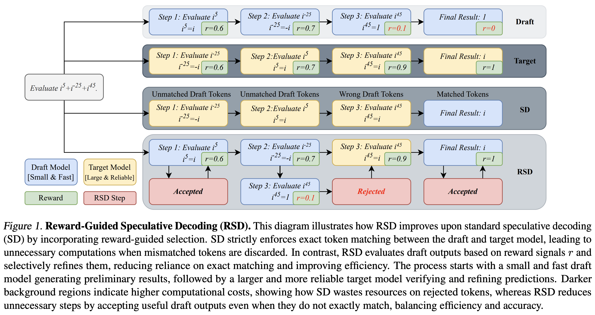

<h3 align="center">
    <p>Reward-Guided Speculative Decoding (RSD) for Efficient LLM Reasoning</p>
</h3>

<h5 align="center">

[](https://arxiv.org/abs/2501.19324)
 <br>

</h5>


## Introduction
<p float="left" align="middle">
  
</p>
We introduce Reward-Guided Speculative Decoding (RSD), a novel framework aimed at improving the efficiency of inference in large language models (LLMs). RSD employs a process reward model to evaluate intermediate decoding steps from draft model, and dynamically decide whether to invoke the target model, optimizing the trade-off between computational cost and output quality. Extensive evaluations on challenging reasoning benchmarks, including Olympiad-level tasks, show that RSD delivers **significant efficiency gains** against decoding with the target model only (up to **4.4x fewer FLOPs**), while achieving significant **better accuracy** than parallel decoding method on average (up to **+3.5**).

## Support
- [x] vLLM online mode: Need at least 3 GPUs to serve the draft, target, and process reward model, since vLLM doesn't support serving multiple models on 1 GPU.
- [ ] vLLM offline mode: Only need 1 GPU, but slower than the online mode, since we only serve the model when needed, then delete it for serving another one.


## Installation
```shell
# For math evaluation
pip install -r requirements.txt 

# For using Skywork-PRM
git clone https://github.com/SkyworkAI/skywork-o1-prm-inference.git
cd skywork-o1-prm-inference
pip install -e .
```

## Efficient Decoding
**1. Preparation**

We mainly use [Qwen2.5-Math family](https://huggingface.co/collections/Qwen/qwen25-math-66eaa240a1b7d5ee65f1da3e) and [Skywork-o1-Open-PRM-Qwen-2.5-1.5B](https://huggingface.co/Skywork/Skywork-o1-Open-PRM-Qwen-2.5-1.5B). You need to change **max_position_embeddings** in their config.json from 4096 to 16384, which aims to avoid max_tokens error in vLLM. We only use the generation shorter than 4096, so this change won't affect the performance.

**2. Model serve**
```shell
bash scripts/serve_draft_model.sh
bash scripts/serve_target_model.sh
bash scripts/serve_prm.sh 
```

**3. Evaluation**
```shell
bash scripts/math_eval.sh
````

## Acknowledgement
Our code base mainly builds on [Qwen2.5-Math](https://github.com/QwenLM/Qwen2.5-Math) and [skywork-o1-prm-inference](https://github.com/SkyworkAI/skywork-o1-prm-inference). Thank you for their open-source effort.

## Citation
```
@misc{liao2025reward,
      title={Reward-Guided Speculative Decoding for Efficient LLM Reasoning}, 
      author={Baohao Liao and Yuhui Xu and Hanze Dong and Junnan Li and Christof Monz and Silvio Savarese and Doyen Sahoo and Caiming Xiong},
      year={2025},
      eprint={2501.19324},
      archivePrefix={arXiv},
      primaryClass={cs.CL},
      url={https://arxiv.org/abs/2501.19324}, 
}
```
